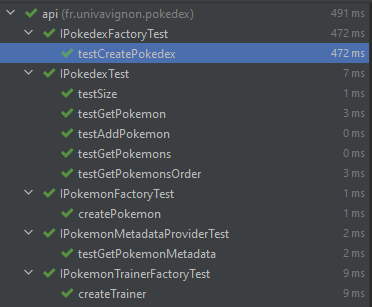

# UCE Génie Logiciel Avancé : Techniques de tests
### EL HAJOUI Mohamed - M1 ILSEN GROUPE 1

----------

---------------

## TP3

Épisode 2 - Catch the API  & Épisode 3 - Use cases

9 tests passed.

  

## TP4

#### Épisode 1 - Code coverage

<ul>
  <li>J'ai rencontré des difficultés à généré un rapport avec Jacoco à cause d'une balise <pluginManagement> dans le pom.xml</pluginManagement></li>
</ul> 

#### Épisode 2 - Badger Badger Badger … MUSHROOM

<ul>
   <li>Rien de difficile, j'ai récupéré les badges directement sur CircleCI et Codecov</li> 
</ul> 

